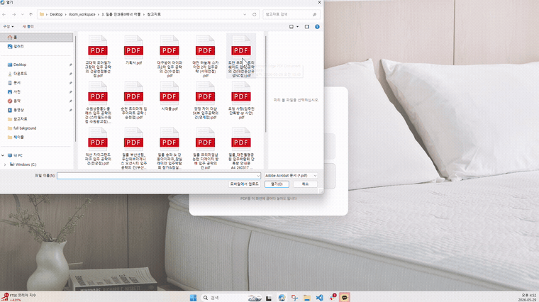
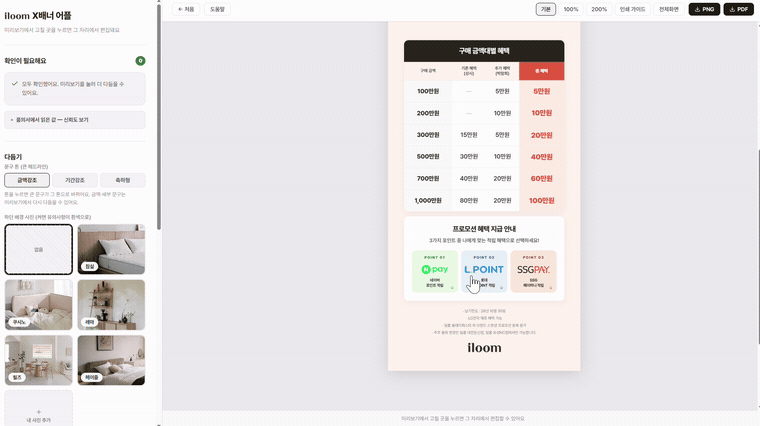
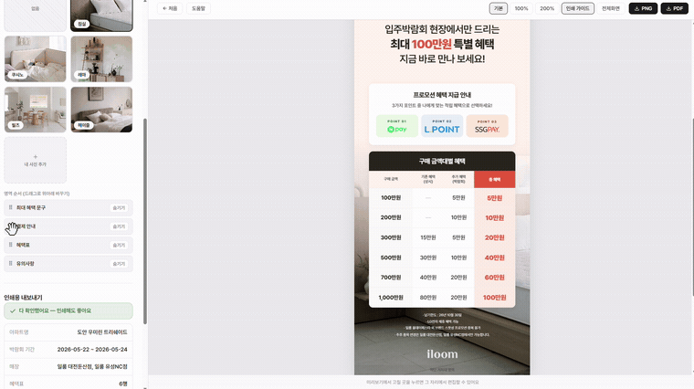
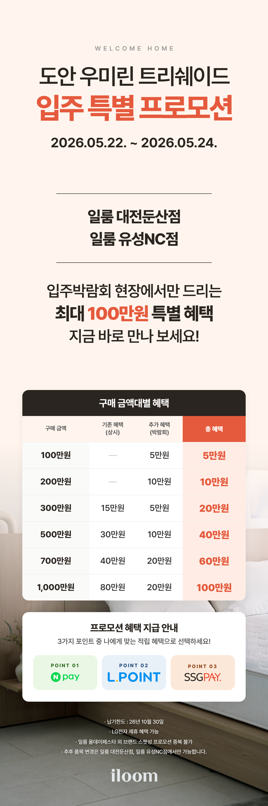

# 품의서를 넣으면, 배너가 나옵니다
작성일: 2026.05.29

안녕하세요, 일룸사업부 영업개발부문 유통경쟁력강화팀 김수지입니다.

지난번에 예고드린 대로, 제가 한 달간 만든 **X배너 자동 제작 어플**을 들고 왔어요.

설명을 길게 하는 것보다, **그냥 보여드리는 게 빠를 것 같아요.** 화면을 따라가 볼게요✨

ㅡㅡㅡㅡㅡㅡㅡㅡㅡㅡㅡㅡㅡㅡㅡㅡㅡㅡㅡㅡㅡㅡㅡㅡㅡㅡㅡㅡㅡㅡㅡㅡㅡ

## 들어가기 전에 — 왜 만들었나

일룸은 **입주박람회가 정말 많아요.** 새 아파트 입주 시즌마다 박람회가 열리고, 그때마다 부스에 세워둘 X배너가 필요합니다. 한 달에도 몇 건씩요.

그런데 이 배너를 만들려면 매번 외부 디자인 업체(디콰이엇)에 맡겨야 했어요. 그것도 대단한 작업이 아니라, **아파트 이름 바꾸고, 매장명 바꾸고, 혜택 금액 몇 줄 고치는** 정도의 아주 사소한 시안인데도요.

그 작은 것 하나에도 요청서를 쓰고, 메일을 보내고, 평균 **3일 이상**을 기다려야 했습니다. 그렇다고 디자인을 모르는 담당자가 직접 만들면 저해상도 출력, 오타, 규격 오류 같은 사고가 나고요.

*"이 정도는 그냥 내가 바로 뽑을 수 있으면 좋겠는데…"*

그래서 한번 만들어봤습니다. *(처음엔 Figma 유료 플랜까지 검토했지만, 결국 구독료 없이 브라우저만 있으면 되는 HTML 방식으로 틀었어요.)*

자, 이제 실제로 어떻게 돌아가는지 보여드릴게요.

ㅡㅡㅡㅡㅡㅡㅡㅡㅡㅡㅡㅡㅡㅡㅡㅡㅡㅡㅡㅡㅡㅡㅡㅡㅡㅡㅡㅡㅡㅡㅡㅡㅡ

## 1️⃣ 품의서를 넣습니다

시작은 정말 단순해요. 어플을 열고, **행사 품의서 PDF를 그대로 끌어다 놓습니다.**

별도로 데이터를 정리하거나 옮겨 적을 필요가 없어요. 우리가 평소 주고받던 그 품의서 PDF를 그대로 넣으면 됩니다.

ㅡㅡㅡㅡㅡㅡㅡㅡㅡㅡㅡㅡㅡㅡㅡㅡㅡㅡㅡㅡㅡㅡㅡㅡㅡㅡㅡㅡㅡㅡㅡㅡㅡ

## 2️⃣ 시안이 나옵니다

업로드하면, **곧바로 배너 시안이 완성돼 화면에 뜹니다.** 그런데 이게 단순히 "빈칸에 글자만 채운" 게 아니에요. 어플이 품의서를 **읽고, 판단하고, 그에 맞게 만들어줍니다.**

**① 품의서를 읽어냅니다**
아파트명, 매장명, 행사 기간, 세대수, 혜택표, 특별 프로모션, 후기 이벤트, 단톡방 URL까지 — 품의서에 흩어져 있는 10여 가지 정보를 자동으로 뽑아내요. 작성하는 담당자가 여럿이라 표 형식도 문장 표현도 제각각인데, 그 다양한 형식을 다 흡수합니다.

**② 어떤 행사인지 스스로 판단합니다**
사실 이게 핵심이에요. 품의서를 보고 "이건 2개 아파트 동시 행사구나", "특별 프로모션이 여러 개네", "제품 카드를 넣어야 하는 케이스네" 하고 **행사 유형을 알아서 분류**한 다음, 그에 맞는 배너 구성을 골라줍니다. 행사마다 형식이 전혀 달라도요.

**③ 레이아웃을 알아서 잡습니다**
혜택표가 4칸이냐 6칸이냐, 글이 많으냐 적으냐에 따라 **폰트 크기·간격·영역 배치가 자동으로 조절**돼요. 600×1800 규격 안에서 빈 공간이 생기면 알아서 채워주고요.

**④ 문구(카피)도 골라줍니다**
행사 기간이 짧으면 금액 강조, 길면 기간 강조, 혜택이 크면 헤드라인에 금액을 — 상황에 맞는 카피 톤을 자동으로 추천합니다.

**⑤ 없는 값은 계산해서 채웁니다**
금액대별 "총 혜택" 합계처럼, 품의서에 적혀 있지 않은 값도 어플이 직접 계산해 넣어요. **빈 칸이나 "-"로 남겨두지 않습니다.**

**⑥ 제품 사진까지 자동으로 넣어줍니다**
품의서에서 제품명을 발견하면, 미리 등록해둔 라이브러리에서 사진을 불러와 알맞은 위치에 배치해요.

여기까지가 **어플이 알아서 해주는 일**이에요. 그럼 이제 내가 손볼 차례죠. 👇

ㅡㅡㅡㅡㅡㅡㅡㅡㅡㅡㅡㅡㅡㅡㅡㅡㅡㅡㅡㅡㅡㅡㅡㅡㅡㅡㅡㅡㅡㅡㅡㅡㅡ

## 3️⃣ 클릭해서 다듬습니다

물론 자동 생성된 건 어디까지나 **초안**이에요. 여기서부터는 내가 손봅니다. 그런데 복잡한 디자인 툴이 필요 없어요. **화면에서 바꾸고 싶은 곳을 클릭하면 바로 수정됩니다.**

먼저 왼쪽에 **"확인이 필요해요"** 패널이 있어요. 어플이 *"이 부분은 사람이 한 번 봐주세요"* 하고, 챙겨야 할 것만 따로 모아 알려줍니다. 그 외에는 화면에서 바로바로 손보면 돼요.

- **글자를 바꾸거나 강조** — 금액을 더 키우거나, 긴 문구를 축약형으로
- **제품 사진 교체** — 자동으로 들어간 사진이 마음에 안 들면, 왼쪽에서 다른 사진으로 클릭 한 번에
- **영역 순서 변경** — 혜택표·결제 안내·제품 카드 순서를 드래그로 자유롭게

디자인을 몰라도, **눌러보면 아는** 수준으로 만들었어요.

ㅡㅡㅡㅡㅡㅡㅡㅡㅡㅡㅡㅡㅡㅡㅡㅡㅡㅡㅡㅡㅡㅡㅡㅡㅡㅡㅡㅡㅡㅡㅡㅡㅡ

## 4️⃣ 인쇄용 PDF, 그리고 발주서까지

다듬기가 끝나면 **인쇄에 바로 쓸 수 있는 PDF(600×1800mm, CMYK)로 저장**됩니다. 규격과 해상도를 코드에 고정해둬서, 누가 만들든 저해상도 사고가 날 일이 없어요.

그리고 여기서 한 발 더 나갔어요. **인쇄소에 보낼 발주서까지 자동으로 만들어줍니다.** 도안명, 규격, 재질, 수량을 채운 발주 정보를 그대로 복사하거나 파일로 받을 수 있어요.

여기까지, 품의서를 넣고 **3분이면** 끝납니다. 3일이 3분이 된 거예요.

그래서 실제로 나온 결과물이 이거예요. 👇

ㅡㅡㅡㅡㅡㅡㅡㅡㅡㅡㅡㅡㅡㅡㅡㅡㅡㅡㅡㅡㅡㅡㅡㅡㅡㅡㅡㅡㅡㅡㅡㅡㅡ

## 💬 그래서, 앞으로

만드는 과정이 매끄럽기만 했던 건 아니에요. 행사마다 품의서 형식이 조금씩 달라 값이 엉뚱한 자리로 들어가기도 하고, 인쇄하면 이미지가 흐려지는 문제도 있었습니다. 클로드 코드에게 "이거 왜 이래?"를 수십 번 물어가며 하나씩 잡았고, **지금은 실무에 써볼 만한 수준**까지 올라왔어요.

가장 큰 변화는 시간이 아니라 **선택지가 늘었다**는 점이에요. 이제는 외주를 기다릴지 직접 도박할지 둘 중 하나가 아니라, **누구나 일정 품질의 초안을 즉시 뽑을 수 있게** 됐습니다.

하지만 이건 어디까지나 **시작**이라고 생각해요. 결국 이 배너를 실제로 쓰는 건 매장과 쇼룸 현장이니까요.

**그러니 현장에서 "이건 이랬으면 좋겠다", "이게 불편하다" 하는 목소리를 많이 들려주세요. 알려주시는 만큼, 최대한 반영해서 더 쓸모 있게 만들어가겠습니다.** 😊🫶
